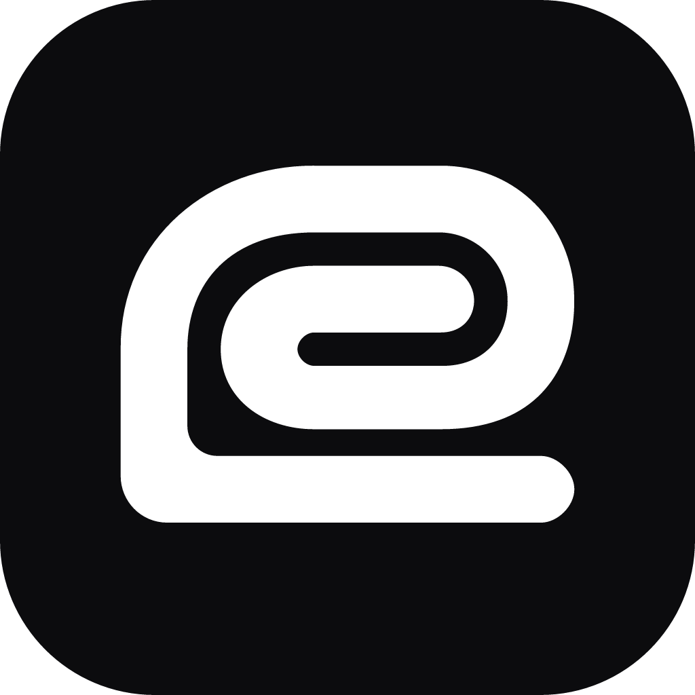
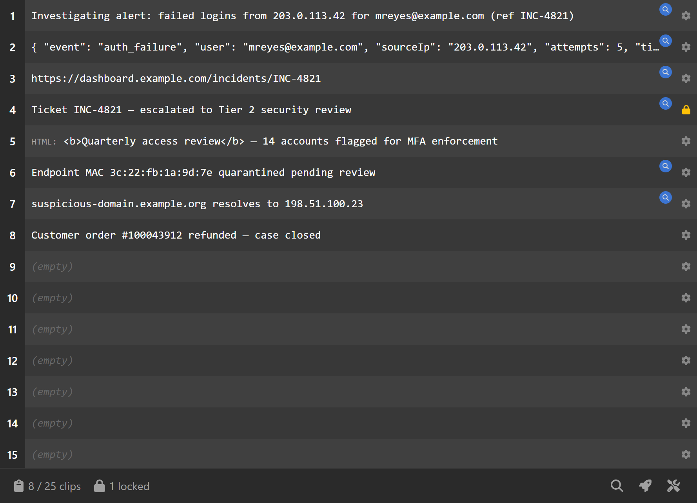
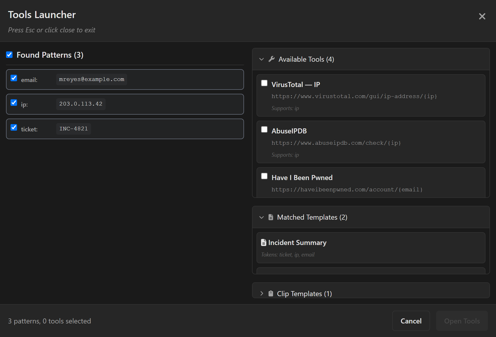
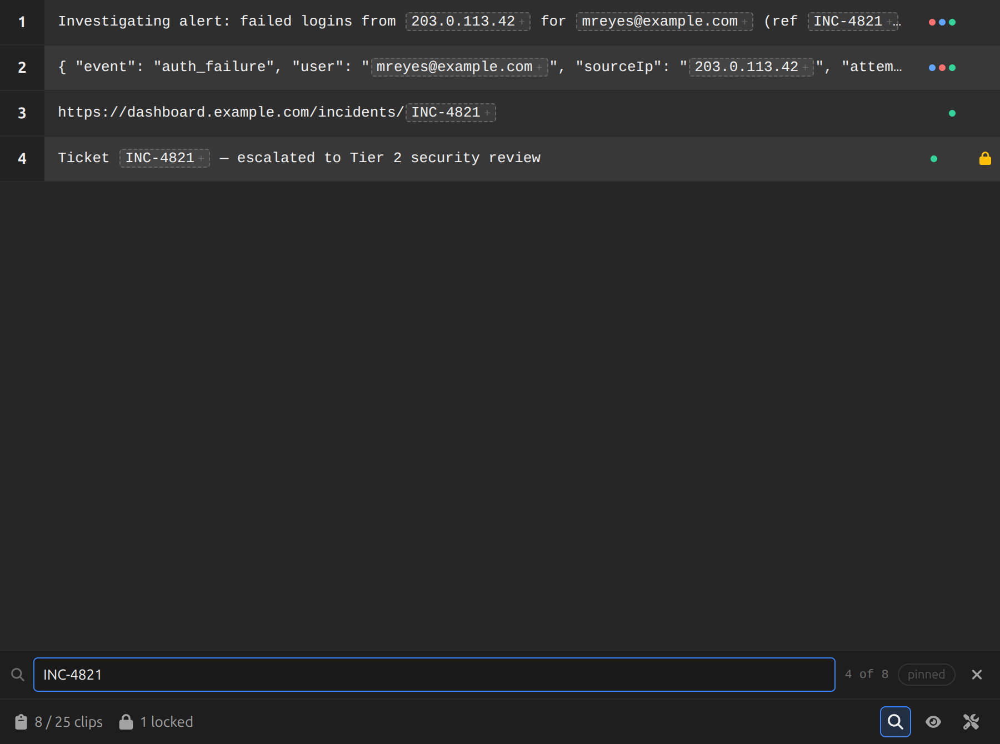
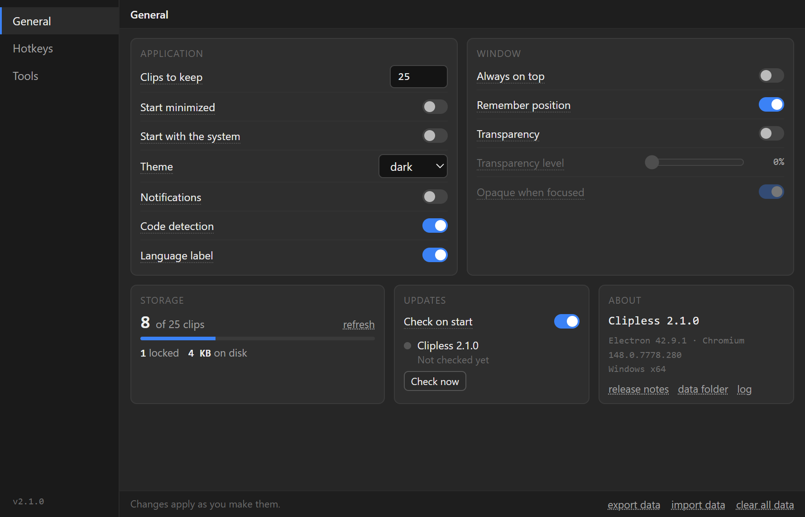

<div align="center">



# Clipless

### The clipboard that reads between the lines.

Clipless quietly remembers everything you copy, then **reads it** — spotting emails, IPs,
tickets and URLs in what you copy and turning them into one-click actions.

<br />

[](https://clipless.app)
[](https://github.com/dantheuber/clipless/releases/latest)
[](https://github.com/dantheuber/clipless/releases)
[](https://clipless.app/download/)
[](#-development)

<br />

[](https://clipless.app/download/)
[](https://clipless.app/docs/)
[](https://github.com/dantheuber/clipless)

<br />

<picture>
  <source media="(prefers-color-scheme: dark)" srcset="site/assets/screens/main-dark.png" />
  <source media="(prefers-color-scheme: light)" srcset="site/assets/screens/main-light.png" />
  
</picture>

<br /><br />

**✓ Windows, macOS &amp; Linux · ✓ Encrypted local storage · ✓ No account needed**

<br />

[Quick Clips](#-quick-clips) · [Quick look](#-quick-look) · [Capture](#-capture-everything) · [Theming](#-looks-right-day-or-night) · [Who it's for](#-who-its-for) · [Install](#-installation) · [Develop](#-development)

</div>

---

## 🔍 Quick Clips

### It reads what you copy.

The moment something useful lands in your clipboard, Clipless flags it. Every value it
pulls out is a chip on the clip row, ready to pin.

- **Automatic detection** — emails, IPs, URLs, phone numbers, ticket IDs and your own custom regex
- **Pick exactly what you need** — each extracted value is individually selectable
- **Named capture groups** — build a pattern once and reuse it across every clip
- **Built-in library** — common data types work out of the box, with a clear visual indicator when patterns are found

<div align="center">

<picture>
  <source media="(prefers-color-scheme: dark)" srcset="site/assets/screens/main-dark.png" />
  <source media="(prefers-color-scheme: light)" srcset="site/assets/screens/main-light.png" />
  
</picture>

</div>

---

## ⚡ Quick look

### Pin a value. Open every tool.

Every match Clipless finds is a chip on the clip row. Click a chip to pin it. The tray under
the list offers the tools that take your pins, and "Open all" turns them into browser tabs in
one click. Quick look opens any clip in full inside the main window, with the same chips and
pins — there the chips are in the tab order, so Tab to one and press Enter or Space to pin it without
leaving the keyboard.

- **Multi-token URLs** — drop values into any link, e.g. `https://tool.com/{ip}/{email}`
- **Open in bulk** — pin several values; the tray states how many tabs it will open before you click
- **Only what fits** — a tool is offered only when every token in its URL has a pinned value
- **Templates &amp; sharing** — ready templates copy their filled-in text to the clipboard, and configs export / import for your team

<div align="center">

<picture>
  <source media="(prefers-color-scheme: dark)" srcset="site/assets/screens/patterns-dark.png" />
  <source media="(prefers-color-scheme: light)" srcset="site/assets/screens/patterns-light.png" />
  
</picture>

</div>

---

## 📋 Capture everything

### Every format, deduplicated and in order.

Real-time clipboard monitoring with 250ms polling, intelligent format prioritization, and
duplicate prevention — all running quietly in the background so it never interrupts your flow.

| Format        | What you get                                               |
| ------------- | ---------------------------------------------------------- |
| **Text**      | Plain text with automatic programming-language detection   |
| **HTML**      | Rich HTML content with visual indicators                   |
| **RTF**       | Full Rich Text Format support                              |
| **Images**    | Image clipboard data with preview and generated thumbnails |
| **Bookmarks** | URLs with titles (macOS / Windows compatible)              |

- **Lock clips** to keep important items from rotating out of history
- **Clip Quick Search** to filter your entire history instantly

<div align="center">

<picture>
  <source media="(prefers-color-scheme: dark)" srcset="site/assets/screens/search-dark.png" />
  <source media="(prefers-color-scheme: light)" srcset="site/assets/screens/search-light.png" />
  
</picture>

</div>

---

## 🌗 Looks right, day or night

### Theming that follows you.

Clipless follows your system theme out of the box and flips instantly when you switch — with
smooth, considered transitions instead of a jarring flash. Prefer to set it yourself? One
dropdown, done.

- **Matches your system** — respects your OS light / dark preference automatically
- **Carefully tuned palettes** — readable contrast and soft surfaces in both modes

<div align="center">

<picture>
  <source media="(prefers-color-scheme: dark)" srcset="site/assets/screens/settings-general-dark.png" />
  <source media="(prefers-color-scheme: light)" srcset="site/assets/screens/settings-general-light.png" />
  
</picture>

<sub>This README does it too — the screenshots above follow your GitHub light / dark setting.</sub>

</div>

---

## ✨ The quiet details

The things you don't notice until you'd miss them.

- **⌨️ Global hotkeys** — reach recent clips and quick look from anywhere, even when Clipless is minimized. Quick-clip hotkeys (1–5) grab your most recent items, and a focus hotkey snaps the window to you. Hotkeys are off by default — flip the master switch in Settings → Hotkeys to turn them on.
- **🔒 Encrypted storage** — history is encrypted with your OS keystore (DPAPI, Keychain or Secret Service) and never leaves your machine. Data is split into domain-specific files for efficient saves, with images stored as separate encrypted files and fast-loading thumbnails.
- **🚀 Non-blocking startup** — the window appears immediately while your history loads in the background.
- **🖥️ Starts with you** — auto-launch on boot, start minimized to the tray, and update quietly in the background (auto-update works on Windows and Linux; macOS still needs a manual reinstall — see [Installing on macOS](#-installing-on-macos)).
- **💾 Backup-friendly** — export and import your clips, patterns, tools and templates.

---

## 👥 Who it's for

Clipless shines anywhere people copy the same kinds of data all day — but nothing about it
is locked to one job. Define your own patterns and tools, and it bends to whatever workflow
you throw at it.

| ☎️ Call center &amp; support                                                                                            | 🗂️ Data entry &amp; admin                                                                                                         | 🛡️ Security &amp; research                                                                                                   |
| ----------------------------------------------------------------------------------------------------------------------- | --------------------------------------------------------------------------------------------------------------------------------- | ---------------------------------------------------------------------------------------------------------------------------- |
| Copy a customer email or account number and open it across your CRM, billing and knowledge-base tools in a single move. | Bridge legacy and modern systems — extract reference numbers, populate templates and process records in batches without retyping. | Pull IPs, domains and hashes from any text and fan them out to VirusTotal, AbuseIPDB and the rest of your toolkit instantly. |

> **…and whatever you do next.** Custom regex patterns, custom tools, custom templates —
> Clipless is a blank canvas with smart defaults. If you can describe the data and where it
> should go, you can wire it up. No use case is too niche.

<details>
<summary><strong>Real-world office scenarios &amp; more roles</strong></summary>

<br />

**Call center &amp; customer support**

- **Customer data lookup** — copy customer emails / phone numbers and instantly open them in CRM, billing or support tools
- **Account verification** — extract account numbers and open multiple verification tools simultaneously
- **Issue tracking** — copy error codes or ticket numbers and launch diagnostic tools, knowledge bases and escalation systems
- **Multi-system navigation** — one copy action can open customer records across 3–4 different systems instantly

**Data entry &amp; administrative work**

- **Form population** — use templates to generate standardized text from clipboard data (addresses, contact info, etc.)
- **Batch processing** — copy reference numbers and open them across multiple validation or processing tools
- **Quality assurance** — extract identifiers and quickly access audit trails, compliance tools and verification systems
- **Cross-platform workflows** — bridge gaps between legacy systems by automating tool launches

**Real-world scenarios**

- **Insurance claims** — copy claim numbers → open in claims system, fraud detection and payment processing
- **Banking support** — copy account numbers → access account details, transaction history and compliance tools
- **Healthcare administration** — copy patient IDs → open in medical records, billing and scheduling systems
- **E-commerce support** — copy order numbers → launch order management, shipping and customer communication tools

**Template-powered productivity**

- **Standardized responses** — create templates for common communications, populated with copied data
- **Report generation** — templates that format clipboard data into structured reports
- **Data transformation** — convert between formats required by different systems
- **Compliance documentation** — generate required documentation with proper formatting from raw copied data

**Also a great fit for**

- **Developers** — code snippet management and URL analysis
- **Researchers** — data extraction and multi-tool workflows
- **Security professionals** — URL / email analysis and validation
- **Content creators** — managing copied content across projects
- **Power users** — anyone who copies lots of data and wants smart organization

</details>

---

## 🚀 How to use

### Basic usage

1. **Install and run** — start Clipless and it begins monitoring your clipboard automatically
2. **Copy content** — anything you copy appears in the Clipless window
3. **Click to reuse** — click a row number to copy that item back to your clipboard
4. **Context menu actions** — right-click a clip for Copy, Scan, Lock and Delete

### Quick Clips workflow

1. **Copy content** containing patterns (emails, URLs, etc.)
2. **Look for the chips** — every match is highlighted on the clip row, one colour per capture group
3. **Pin what you need** — click a chip, or open quick look to read the clip in full and pin from there
4. **Open tools** — the tray lists the tools that take your pins; "Open all" opens every tab at once

**Example uses:** extract emails and open them in validation tools · pull domains and run them
through security scanners · gather multiple data points to research across tools · grab code
snippets and open them in your documentation.

### Settings &amp; customization

- **Access settings** — right-click the system tray icon → Settings
- **Configure patterns** — Settings → Quick Clips → Search Terms
- **Add tools** — Settings → Quick Clips → Tools
- **Set hotkeys** — Settings → Hotkeys
- **Adjust preferences** — Settings → General
- **Auto start with system** — Settings → General (Windows &amp; macOS)
- **Start minimized** — Settings → General (start hidden in the tray)

📖 Full reference at **[clipless.app/docs](https://clipless.app/docs/)**.

---

## 📥 Installation

Download the latest build for **Windows**, **macOS** or **Linux** from the **[download page](https://clipless.app/download/)**
or the **[GitHub releases](https://github.com/dantheuber/clipless/releases)**.

### 🐧 Installing on Linux

Releases ship two Linux formats — pick whichever suits your setup:

| Format      | Install                                           | Auto-update                           |
| ----------- | ------------------------------------------------- | ------------------------------------- |
| `.deb`      | `sudo apt install ./clipless_<version>_amd64.deb` | ✅ in-app (prompts for your password) |
| `.AppImage` | `chmod +x clipless-<version>.AppImage` and run it | ✅ in-app                             |

**Debian / Ubuntu (`.deb`)** — the recommended option. Installing with `apt` resolves dependencies
and registers the desktop entry and icon, so Clipless appears in your app grid and taskbar:

```bash
sudo apt install ./clipless_<version>_amd64.deb
```

To remove it: `sudo apt remove clipless`.

> **Auto-update on `.deb`:** when an update is downloaded, installing it needs root, so you'll get a
> polkit password prompt. Decline it and the app keeps running on the current version — reinstall
> the newer `.deb` by hand whenever you like.

### 🍎 Installing on macOS

macOS builds aren't code-signed yet. This causes `.dmg` files downloaded from releases to not immediately work.
The sticking point is **Gatekeeper**: anything downloaded through a browser gets a
`com.apple.quarantine` flag, and macOS refuses to open a quarantined, unsigned app — usually
with _"Clipless is damaged and can't be opened."_ The DMG isn't actually damaged; clearing that
flag (or building locally, where it's never applied) fixes it. Two ways to install:

**Option 1 — Download a `.dmg` and clear the quarantine flag** _(recommended)_

1. Get the Clipless `.dmg` for your Mac from a [release](https://github.com/dantheuber/clipless/releases) — `arm64` for Apple Silicon, `x64` for Intel (or a build artifact)
2. Open it and drag **Clipless** into your **Applications** folder
3. Remove the quarantine flag in Terminal:
   ```bash
   xattr -dr com.apple.quarantine /Applications/Clipless.app
   ```
4. Launch Clipless normally — Gatekeeper will let it through

**Option 2 — Build it yourself** _(no Terminal step on a downloaded file)_

A DMG you compile locally never receives the quarantine flag, so it installs straight away.
You'll need the **Xcode Command Line Tools** (`xcode-select --install`) and **Node.js 20+**.

```bash
git clone https://github.com/dantheuber/clipless.git
cd clipless
npm ci
npm run build:mac
```

This produces two disk images in `dist/` — `clipless-<version>-arm64.dmg` (Apple Silicon) and
`clipless-<version>-x64.dmg` (Intel). Open the one matching your Mac and drag **Clipless** into
**Applications**.

> **Architecture:** macOS releases ship separate `.dmg` files for **Apple Silicon (arm64)** and
> **Intel (x86_64)**. Download the one matching your Mac.

> **Auto-update:** in-app automatic updates don't work on macOS yet, because they require a
> code-signed app and the macOS builds are currently unsigned. On macOS, update by downloading
> the latest `.dmg` from [releases](https://github.com/dantheuber/clipless/releases) and
> reinstalling. (Windows auto-updates normally.)

<details>
<summary><strong>⚠️ A note on security warnings during install</strong></summary>

<br />

Clipless isn't code-signed with a commercial certificate yet, so your OS may warn that the
app is from an "unidentified developer" or "untrusted source." This is expected and safe to
override — the build comes straight from this open-source repository.

**Why this happens**

- **Windows** — "Windows protected your PC" or SmartScreen warnings
- **macOS** — "cannot be opened because it is from an unidentified developer"
- **Linux** — some distributions may flag the AppImage as untrusted

**Why it's safe**

- The application is built from open source code available in this repository
- You can verify build integrity by reviewing the source
- There's no malicious code — this is purely a certificate-signing issue

**How to install past the warning**

- **Windows** — click "More info" → "Run anyway", or temporarily disable SmartScreen
- **macOS** — see [Installing on macOS](#-installing-on-macos) above (clear the quarantine flag, or build locally)
- **Linux** — make the AppImage executable and run it, or adjust your security settings if needed

**Looking ahead** — if Clipless gains enough community adoption, a commercial code-signing
certificate (several hundred dollars a year) will eliminate these warnings. For now, the
warnings are purely administrative and the app is safe to use.

</details>

---

## 🧰 Development

Clipless is an Electron app built with `electron-vite`, React 19, TypeScript and Tailwind CSS v4.

### Setup

```bash
npm install
npm run dev      # start with hot reload
```

### Scripts

| Command                                           | What it does                       |
| ------------------------------------------------- | ---------------------------------- |
| `npm run dev`                                     | Start development with hot reload  |
| `npm run build`                                   | Type-check and build all processes |
| `npm run lint`                                    | ESLint with caching                |
| `npm run format`                                  | Prettier formatting                |
| `npm run typecheck`                               | Type-check all TypeScript          |
| `npm test` / `npx vitest`                         | Unit tests (Vitest)                |
| `npx playwright test`                             | E2E tests (Playwright + Electron)  |
| `npm run build:win` · `build:mac` · `build:linux` | Platform-specific packaging        |

> **Heads up:** E2E tests interact with your **system clipboard** — they read from and write
> to it. Avoid copying sensitive data before running them, and expect your clipboard contents
> to be overwritten.

### Recommended IDE setup

[VS Code](https://code.visualstudio.com/) + [ESLint](https://marketplace.visualstudio.com/items?itemName=dbaeumer.vscode-eslint) + [Prettier](https://marketplace.visualstudio.com/items?itemName=esbenp.prettier-vscode)

## 📄 License

Clipless is released under the [MIT License](LICENSE) — you're free to use, modify, and
distribute it, including in forks and derivative works. The only condition is that the
original copyright and license notice be retained, so the original project is always credited.

---

<div align="center">

Built with Electron, React &amp; TypeScript. Your data is encrypted with your OS-native
keystore and never leaves your machine.

[**clipless.app**](https://clipless.app) · [Documentation](https://clipless.app/docs/) · [Download](https://clipless.app/download/) · [GitHub](https://github.com/dantheuber/clipless)

</div>
